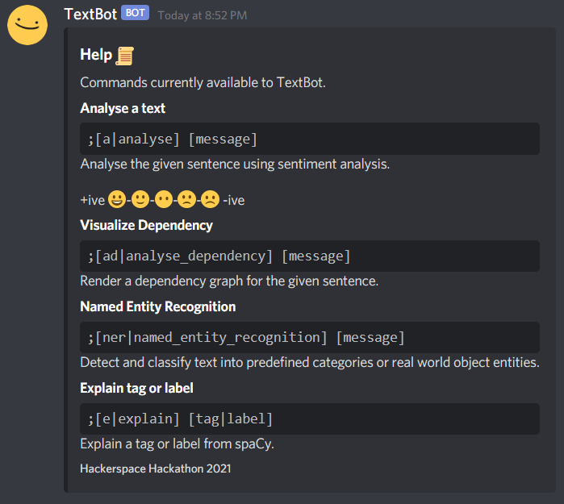
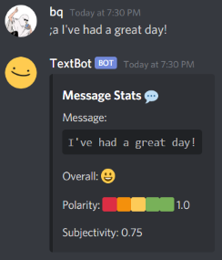
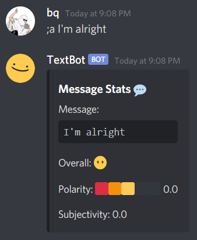
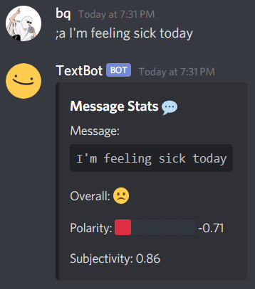
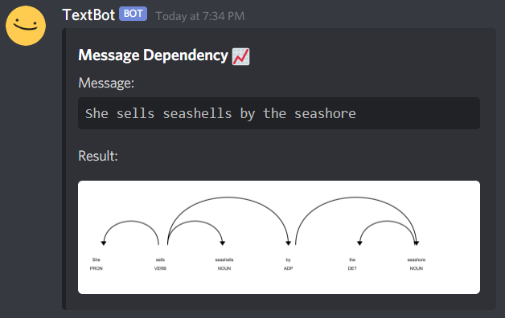
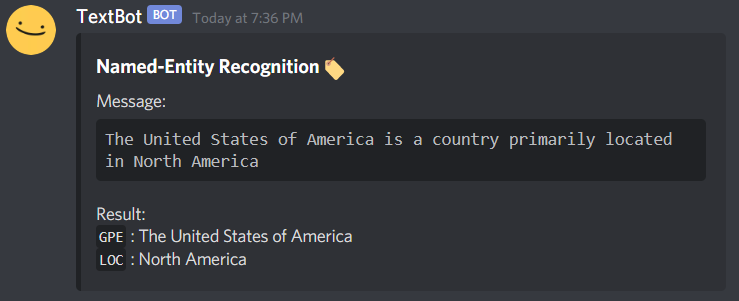
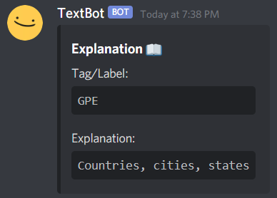

# TextBot
 A sentiment analysis Discord bot build with spaCy and TextBlob during MMU Hackerspace Hackathon 2021! 

## Commands

`;help`- Get a list currently available commands. More commands soon :)



`;a [message]`- Analyse a given text by showing an overall emoji to indicate the extent of positiveness or negativeness in the statement. It also shows other stats such as polarity and subjectivity.
Polarity: [-1,1] 
Subjectivity: [0,1]

| A Positive Statement                                     | A Neutral Statement                                       | A Negative Statement                                      |
| -------------------------------------------------------- | --------------------------------------------------------- | --------------------------------------------------------- |
|  |  |  |

`;ad [message]`- Render a dependency graph from the given sentence. This show the relationship between each word and its type of parts of speech (this feature contains a bug, still fixing in progress)



`;ner [message]`- Detects named-entities in the sentence. NER helps to recognize the key elements in a sentence.



`;e [tag || label]`- Explains the meaning of a tag/label from spaCy.




## Guide to Running TextBot Locally

1. Create a new application on [Discord Developer Portal](https://discord.com/developers/applications). Create a bot and copy the token. Invite the bot to one of your servers too.

2. Clone this repository.

3. Create a `.env` file in the same directory and paste your token.

   ```
   TOKEN=<token>
   ```

4. Install the spaCy library along with the English language model.

   ```
   $ pip install spacy
   $ python -m spacy download en_core_web_sm
   ```

5. Install spacytextblob, which is basically spaCy + Textblob. This adds Textblob to the last step of the spaCy nlp pipline.

   ```
   $ pip install spacytextblob   
   $ python -m textblob.download_corpora
   ```

6. Install svglib, which allows Python to read `.svg` files and convert them into `.png`. files.

   [Optional] Install python-decouple for reading environmental variables (for secret bot token).

   ```
   $ pip install svglib
   $ pip install python-decouple 
   ```

7. Run the bot. The bot should now be online. 


## Useful Links and Learning Materials

1. [SpaCy Python Tutorials by JCharisTech & J-Secur1ty](https://youtube.com/playlist?list=PLJ39kWiJXSiz1LK8d_fyxb7FTn4mBYOsD)
2. [Code a Discord Bot with Python by freeCodeCamp](https://www.youtube.com/watch?v=SPTfmiYiuok)
3. [Python Natural Language Processing: spaCy VS TextBlob](https://python.libhunt.com/compare-spacy-vs-textblob)
