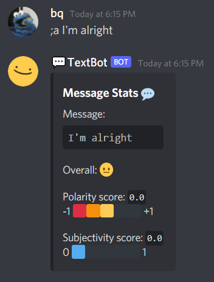

# TextBot :speech_balloon:
A sentiment analysis Discord bot build with spaCy and TextBlob during [MMU Hackerspace](https://hackerspacemmu.github.io/)'s 2021 Hackathon!  


Inspiration: _Not sure what kind of emotion your friends want to express over the internet? Just do sentiment analysis!_

## Commands

### open help menu

`;help`- Get a list of currently available commands. More commands soon!


### analyse text

`;a [message]`- Analyse a given text by showing an overall emoji to indicate the extent of positiveness or negativeness in the statement. It also shows other stats such as polarity and subjectivity.

Polarity: [-1,1] 

Subjectivity: [0,1]

| A Positive Statement                                     | A Neutral Statement                                       | A Negative Statement                                      |
| -------------------------------------------------------- | --------------------------------------------------------- | --------------------------------------------------------- |
|  |  |  |

### view dependency 

`;ad [message]`- Render a dependency graph from the given sentence. This show the relationship between each word and its type of parts of speech  
⚠️this feature contains a bug, still finding a way to fix


### named-entity recognition

`;ner [message]`- Detects named-entities in the sentence. NER helps to recognize the key elements in a sentence.


### explain a tag

`;e [tag || label]`- Explains the meaning of a tag/label from spaCy.


### deleting cache

`;del`- Deletes cache images.


## Guide to Running TextBot Locally

1. Create a new application on [Discord Developer Portal](https://discord.com/developers/applications). Add a bot and copy the token. Then invite the bot to one of your servers too.

2. Clone this repository.

3. Create a `.env` file in the same directory and paste your token.

   ```
   TOKEN=<token>
   ```

4. Installing packages.  
   Install the spaCy library along with the English language model.

   ```
   $ pip install spacy
   $ python -m spacy download en_core_web_sm
   ```

   Install spacytextblob, which is basically spaCy + Textblob. This adds Textblob to the last step of the spaCy nlp pipline.

   ```
   $ pip install spacytextblob   
   $ python -m textblob.download_corpora
   ```

   Install svglib, which allows Python to read `.svg` files and convert them into `.png` files.

   ```
   $ pip install svglib
   ```

5. Run the bot. The bot should now be online. 

### 📦 Packages

A list of packages and their respective version that were used to run the bot.

```txt
discord==1.7.3
spacy==3.1.1
spacytextblob==3.0.1
textblob==0.15.3
svglib==1.1.0
python-dotenv==0.19.0
flask==2.0.1
```

## Useful Links and Learning Materials

1. [SpaCy Python Tutorials by JCharisTech & J-Secur1ty](https://youtube.com/playlist?list=PLJ39kWiJXSiz1LK8d_fyxb7FTn4mBYOsD)
2. [Code a Discord Bot with Python by freeCodeCamp](https://www.youtube.com/watch?v=SPTfmiYiuok)
3. [Python Natural Language Processing: spaCy VS TextBlob](https://python.libhunt.com/compare-spacy-vs-textblob)
